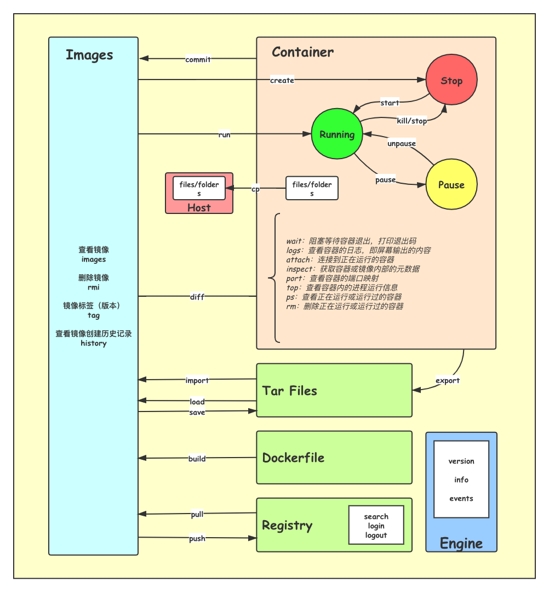

# Docker

## 安装

### Ubuntu

官方文档：https://docs.docker.com/engine/install/ubuntu/

```shell
# 卸载旧版本
sudo apt-get remove docker docker-engine docker.io containerd runc

# 更新apt软件包索引并安装软件包以允许apt通过HTTPS使用存储库
sudo apt-get update
sudo apt-get install \
    apt-transport-https \
    ca-certificates \
    curl \
    gnupg-agent \
    software-properties-common
    
# 添加Docker的官方GPG密钥：9DC8 5822 9FC7 DD38 854A  E2D8 8D81 803C 0EBF CD88
curl -fsSL https://download.docker.com/linux/ubuntu/gpg | sudo apt-key add -

# 通过搜索指纹的后8个字符，验证您现在是否拥有带有指纹的密钥
sudo apt-key fingerprint 0EBFCD88

# 添加仓库
sudo add-apt-repository \
   "deb [arch=amd64] https://download.docker.com/linux/ubuntu \
   $(lsb_release -cs) \
   stable"
   
# 安装docker引擎，最新版本
sudo apt-get update
sudo apt-get install docker-ce docker-ce-cli containerd.io

# 安装指定docker版本
# a.列出您的仓库中可用的版本
	apt-cache madison docker-ce
# b.安装指定版本
	sudo apt-get install docker-ce=<VERSION_STRING> docker-ce-cli=<VERSION_STRING> containerd.io

#启动docker
sudo systemctl start docker

# 验证docker安装成功
sudo docker run hello-world

```

### CentOS

官方文档：https://docs.docker.com/engine/install/centos/

```shell
# 卸载旧版本
sudo yum remove docker \
                  docker-client \
                  docker-client-latest \
                  docker-common \
                  docker-latest \
                  docker-latest-logrotate \
                  docker-logrotate \
                  docker-engine

# 配置镜像仓库
sudo yum install -y yum-utils
sudo yum-config-manager \
    --add-repo \
    https://download.docker.com/linux/centos/docker-ce.repo
    
# 安装docker引擎，最新版本
sudo yum install docker-ce docker-ce-cli containerd.io

# 安装指定docker版本
# a.列出您的仓库中可用的版本
	yum list docker-ce --showduplicates | sort -r
# b.安装指定版本
	sudo yum install docker-ce-<VERSION_STRING> docker-ce-cli-<VERSION_STRING> containerd.io

#启动docker
sudo systemctl start docker

# 验证docker安装成功
sudo docker run hello-world
```


### Windows & Mac

docker提供了Windows & Mac 提供了 Docker Desktop版本，傻瓜式安装。

Windows: https://hub.docker.com/editions/community/docker-ce-desktop-mac/

Mac: https://hub.docker.com/editions/community/docker-ce-desktop-windows/

### Kitematic

配合Kitematic使用，一键拉取运行镜像 ，支持Windows、Mac、Ubuntu。

下载地址：https://github.com/docker/kitematic/tags


## Docker命令

### 基础命令


（图片源地址：https://blog.fntsr.tw/articles/189/）



#### 镜像相关

##### docker tag	

Create a tag TARGET_IMAGE that refers to SOURCE_IMAGE

```shell
root@Yuan-Ubuntu:~# docker images
REPOSITORY   TAG       IMAGE ID       CREATED         SIZE
redis        latest    5e25361b75a2   6 minutes ago   252MB
redis        6.2.0     cc69ae189a1a   32 hours ago    105MB
rabbitmq     latest    99720090a9d6   7 days ago      156MB
centos       latest    300e315adb2f   2 months ago    209MB
root@Yuan-Ubuntu:~# docker tag redis:latest redis:5.2
root@Yuan-Ubuntu:~# docker images
REPOSITORY   TAG       IMAGE ID       CREATED         SIZE
redis        5.2       5e25361b75a2   6 minutes ago   252MB
redis        latest    5e25361b75a2   6 minutes ago   252MB
redis        6.2.0     cc69ae189a1a   32 hours ago    105MB
rabbitmq     latest    99720090a9d6   7 days ago      156MB
centos       latest    300e315adb2f   2 months ago    209MB
```

##### docker build	

Build an image from a Dockerfile

```shell
# Dockerfile
FROM centos
RUN yum install -y wget
RUN wget -O redis.tar.gz "http://download.redis.io/releases/redis-5.0.3.tar.gz"
RUN tar -xvf redis.tar.gz
FROM centos
RUN yum install -y wget \
    && wget -O redis.tar.gz "http://download.redis.io/releases/redis-5.0.3.tar.gz" \
    && tar -xvf redis.tar.gz

# docker build .
```

##### docker builder	

Manage builds

##### docker commit	

Create a new image from a container’s changes

##### docker pull	

Pull an image or a repository from a registry

```shell
# 拉取指定版本的redis镜像
root@Yuan-Ubuntu:~# docker pull redis:6.2.0
6.2.0: Pulling from library/redis
45b42c59be33: Pull complete
5ce2e937bf62: Pull complete
2a031498ff58: Pull complete
7407cbab5258: Pull complete
c2d6c3b35be8: Pull complete
1997ce073dcd: Pull complete
Digest: sha256:26bd5f3d2bbfb21d0e4f03d642570e63c8776d2a9e5963e4057280fb3b4e3e29
Status: Downloaded newer image for redis:6.2.0
docker.io/library/redis:6.2.0
```

##### docker push	

Push an image or a repository to a registry

##### docker history	

Show the history of an image

```shell
# 可看到镜像制作的历史过程
root@Yuan-Ubuntu:~# docker history redis:6.2.0
IMAGE          CREATED        CREATED BY                                      SIZE      COMMENT
cc69ae189a1a   30 hours ago   /bin/sh -c #(nop)  CMD ["redis-server"]         0B
<missing>      30 hours ago   /bin/sh -c #(nop)  EXPOSE 6379                  0B
<missing>      30 hours ago   /bin/sh -c #(nop)  ENTRYPOINT ["docker-entry…   0B
<missing>      30 hours ago   /bin/sh -c #(nop) COPY file:df205a0ef6e6df89…   374B
<missing>      30 hours ago   /bin/sh -c #(nop) WORKDIR /data                 0B
<missing>      30 hours ago   /bin/sh -c #(nop)  VOLUME [/data]               0B
<missing>      30 hours ago   /bin/sh -c mkdir /data && chown redis:redis …   0B
<missing>      30 hours ago   /bin/sh -c set -eux;   savedAptMark="$(apt-m…   31.6MB
<missing>      30 hours ago   /bin/sh -c #(nop)  ENV REDIS_DOWNLOAD_SHA=67…   0B
<missing>      30 hours ago   /bin/sh -c #(nop)  ENV REDIS_DOWNLOAD_URL=ht…   0B
<missing>      30 hours ago   /bin/sh -c #(nop)  ENV REDIS_VERSION=6.2.0      0B
<missing>      2 weeks ago    /bin/sh -c set -eux;  savedAptMark="$(apt-ma…   4.15MB
<missing>      2 weeks ago    /bin/sh -c #(nop)  ENV GOSU_VERSION=1.12        0B
<missing>      2 weeks ago    /bin/sh -c groupadd -r -g 999 redis && usera…   329kB
<missing>      2 weeks ago    /bin/sh -c #(nop)  CMD ["bash"]                 0B
<missing>      2 weeks ago    /bin/sh -c #(nop) ADD file:d5c41bfaf15180481…   69.2MB
root@Yuan-Ubuntu:~#
```

##### docker image	

Manage images

```shell
# 管理镜像命令，和其它管理镜像的命令类似
  build       Build an image from a Dockerfile
  history     Show the history of an image
  import      Import the contents from a tarball to create a filesystem image
  inspect     Display detailed information on one or more images
  load        Load an image from a tar archive or STDIN
  ls          List images
  prune       Remove unused images
  pull        Pull an image or a repository from a registry
  push        Push an image or a repository to a registry
  rm          Remove one or more images
  save        Save one or more images to a tar archive (streamed to STDOUT by default)
  tag         Create a tag TARGET_IMAGE that refers to SOURCE_IMAGE
```

##### docker images	

List images

```shell
# 查看所有镜像
root@Yuan-Ubuntu:~# docker images
REPOSITORY   TAG       IMAGE ID       CREATED        SIZE
redis        6.2.0     cc69ae189a1a   30 hours ago   105MB
rabbitmq     latest    99720090a9d6   7 days ago     156MB
centos       latest    300e315adb2f   2 months ago   209MB
```

##### docker rmi	

Remove one or more images

```shell
# 比如我要删除hello-world镜像
# 首先确保没有容器在使用该镜像，否则删不掉
root@Yuan-Ubuntu:~# docker ps -a
CONTAINER ID   IMAGE         COMMAND                  CREATED          STATUS                      PORTS     NAMES
12b047a4530f   redis:6.2.0   "docker-entrypoint.s…"   8 minutes ago    Exited (0) 24 seconds ago             new_redis
103c9c8b827f   redis:6.2.0   "docker-entrypoint.s…"   11 minutes ago   Exited (0) 24 seconds ago             stupefied_murdock
94d2cf2570c0   redis:6.2.0   "docker-entrypoint.s…"   13 minutes ago   Exited (0) 24 seconds ago             dreamy_bassi
348aba2c17d4   rabbitmq      "docker-entrypoint.s…"   3 hours ago      Exited (0) 19 seconds ago             sleepy_goldstine
057aa2624bc3   rabbitmq      "docker-entrypoint.s…"   3 hours ago      Exited (0) 19 seconds ago             sleepy_cannon
4785044579f0   centos        "/bin/bash"              3 hours ago      Exited (0) 3 minutes ago              funny_dhawan
# 查看所有镜像
root@Yuan-Ubuntu:~# docker images
REPOSITORY    TAG       IMAGE ID       CREATED         SIZE
redis         6.2.0     cc69ae189a1a   30 hours ago    105MB
rabbitmq      latest    99720090a9d6   7 days ago      156MB
centos        latest    300e315adb2f   2 months ago    209MB
hello-world   latest    bf756fb1ae65   13 months ago   13.3kB
# 删除镜像，有多个版本的时要跟上:版本号
root@Yuan-Ubuntu:~# docker rmi hello-world
Untagged: hello-world:latest
Untagged: hello-world@sha256:95ddb6c31407e84e91a986b004aee40975cb0bda14b5949f6faac5d2deadb4b9
Deleted: sha256:bf756fb1ae65adf866bd8c456593cd24beb6a0a061dedf42b26a993176745f6b
Deleted: sha256:9c27e219663c25e0f28493790cc0b88bc973ba3b1686355f221c38a36978ac63
root@Yuan-Ubuntu:~#
```

##### docker save	

Save one or more images to a tar archive (streamed to STDOUT by default)

##### docker search	

Search the Docker Hub for images

```shell
# 查找镜像，具体版本要到dockerhub上找
root@Yuan-Ubuntu:~# docker search redis
NAME                             DESCRIPTION                                     STARS     OFFICIAL   AUTOMATED
redis                            Redis is an open source key-value store that…   9140      [OK]
bitnami/redis                    Bitnami Redis Docker Image                      173                  [OK]
sameersbn/redis                                                                  83                   [OK]
grokzen/redis-cluster            Redis cluster 3.0, 3.2, 4.0, 5.0, 6.0           76
rediscommander/redis-commander   Alpine image for redis-commander - Redis man…   54                   [OK]
redislabs/redisearch             Redis With the RedisSearch module pre-loaded…   30
redislabs/redis                  Clustered in-memory database engine compatib…   27
redislabs/redisinsight           RedisInsight - The GUI for Redis                25
oliver006/redis_exporter          Prometheus Exporter for Redis Metrics. Supp…   23
redislabs/rejson                 RedisJSON - Enhanced JSON data type processi…   23
arm32v7/redis                    Redis is an open source key-value store that…   22
bitnami/redis-sentinel           Bitnami Docker Image for Redis Sentinel         19                   [OK]
redislabs/redisgraph             A graph database module for Redis               15                   [OK]
webhippie/redis                  Docker images for Redis                         11                   [OK]
arm64v8/redis                    Redis is an open source key-value store that…   10
s7anley/redis-sentinel-docker    Redis Sentinel                                  10                   [OK]
redislabs/redismod               An automated build of redismod - latest Redi…   9                    [OK]
insready/redis-stat              Docker image for the real-time Redis monitor…   9                    [OK]
goodsmileduck/redis-cli          redis-cli on alpine                             7                    [OK]
centos/redis-32-centos7          Redis in-memory data structure store, used a…   5
circleci/redis                   CircleCI images for Redis                       5                    [OK]
clearlinux/redis                 Redis key-value data structure server with t…   3
tiredofit/redis                  Redis Server w/ Zabbix monitoring and S6 Ove…   1                    [OK]
wodby/redis                      Redis container image with orchestration        1                    [OK]
xetamus/redis-resource           forked redis-resource                           0                    [OK]
```

##### docker trust	

Manage trust on Docker images

##### docker save	

Save one or more images to a tar archive (streamed to STDOUT by default)

##### docker load	

Load an image from a tar archive or STDIN

##### docker login	

Log in to a Docker registry

##### docker logout	

Log out from a Docker registry

#### 容器相关

docker attach	

Attach local standard input, output, and error streams to a running container

```shell
root@Yuan-Ubuntu:~# docker ps
CONTAINER ID   IMAGE         COMMAND                  CREATED          STATUS         PORTS                    NAMES
12b047a4530f   redis:6.2.0   "docker-entrypoint.s…"   27 minutes ago   Up 2 minutes   0.0.0.0:8000->6379/tcp   new_redis
root@Yuan-Ubuntu:~# docker attach new_redis
```


##### docker container	

Manage containers

```shell
# 管理容器的命令集合
attach      Attach local standard input, output, and error streams to a running container
  commit      Create a new image from a container's changes
  cp          Copy files/folders between a container and the local filesystem
  create      Create a new container
  diff        Inspect changes to files or directories on a container's filesystem
  exec        Run a command in a running container
  export      Export a container's filesystem as a tar archive
  inspect     Display detailed information on one or more containers
  kill        Kill one or more running containers
  logs        Fetch the logs of a container
  ls          List containers
  pause       Pause all processes within one or more containers
  port        List port mappings or a specific mapping for the container
  prune       Remove all stopped containers
  rename      Rename a container
  restart     Restart one or more containers
  rm          Remove one or more containers
  run         Run a command in a new container
  start       Start one or more stopped containers
  stats       Display a live stream of container(s) resource usage statistics
  stop        Stop one or more running containers
  top         Display the running processes of a container
  unpause     Unpause all processes within one or more containers
  update      Update configuration of one or more containers
  wait        Block until one or more containers stop, then print their exit codes
```

##### docker context	

Manage contexts

##### docker cp	

Copy files/folders between a container and the local filesystem

##### docker create

Create a new container

##### docker diff	

Inspect changes to files or directories on a container’s filesystem

##### docker engine	

Manage the docker engine

##### docker events	

Get real time events from the server

##### docker exec	

Run a command in a running container

```shell
root@Yuan-Ubuntu:~# docker exec 12b047a4530f ls
dump.rdb
```

##### docker export	

Export a container’s filesystem as a tar archive

```shell
# 导出
root@Yuan-Ubuntu:~# docker export 12b047a4530f -o redis.tar
root@Yuan-Ubuntu:~# ls
redis.tar.gz  snap
```

##### docker import	

Import the contents from a tarball to create a filesystem image

##### docker info	

Display system-wide information

```shell
# 查看docker系统的信息
root@Yuan-Ubuntu:~# docker info
Client:
 Context:    default
 Debug Mode: false
 Plugins:
  app: Docker App (Docker Inc., v0.9.1-beta3)
  buildx: Build with BuildKit (Docker Inc., v0.5.1-docker)

Server:
 Containers: 6
  Running: 0
  Paused: 0
  Stopped: 6
 Images: 3
 Server Version: 20.10.3
 Storage Driver: overlay2
 ...
```

##### docker inspect	

Return low-level information on Docker objects

##### docker kill	

Kill one or more running containers

```shell
root@Yuan-Ubuntu:~# docker kill 94d2cf2570c0
94d2cf2570c0
root@Yuan-Ubuntu:~# docker ps
CONTAINER ID   IMAGE      COMMAND                  CREATED       STATUS       PORTS                                                 NAMES
348aba2c17d4   rabbitmq   "docker-entrypoint.s…"   2 hours ago   Up 2 hours   4369/tcp, 5671-5672/tcp, 15691-15692/tcp, 25672/tcp   sleepy_goldstine

```

##### docker logs	

Fetch the logs of a container

##### docker manifest	

Manage Docker image manifests and manifest lists

##### docker network	

Manage networks

```shell
root@Yuan-Ubuntu:~# docker network ls
NETWORK ID     NAME      DRIVER    SCOPE
248a0a65a361   bridge    bridge    local
6ad3a44d85fe   host      host      local
3a07c5f8816a   none      null      local
```

##### docker plugin	

Manage plugins

##### docker port	

List port mappings or a specific mapping for the container

```shell
root@Yuan-Ubuntu:~# docker run -d -p 8000:6379 --name my_redis redis:6.2.0
12b047a4530fc8edb9dff0cf6cf4120019f21a64c5b4b71a41e31913c68e50d2
root@Yuan-Ubuntu:~# docker ps
CONTAINER ID   IMAGE         COMMAND                  CREATED         STATUS         PORTS                                                 NAMES
12b047a4530f   redis:6.2.0   "docker-entrypoint.s…"   8 seconds ago   Up 5 seconds   0.0.0.0:8000->6379/tcp                                my_redis
348aba2c17d4   rabbitmq      "docker-entrypoint.s…"   2 hours ago     Up 2 hours     4369/tcp, 5671-5672/tcp, 15691-15692/tcp, 25672/tcp   sleepy_goldstine
root@Yuan-Ubuntu:~# docker port 12b047a4530f
6379/tcp -> 0.0.0.0:8000
```

##### docker run	

Run a command in a new container

```shell
root@Yuan-Ubuntu:~# docker run -d redis:6.2.0
94d2cf2570c05f042f1f68e714c4472a7ba2db4276f8bd84eefbfdbc271e2f87
```

##### docker ps	

List containers

```shell

root@Yuan-Ubuntu:~# docker ps
CONTAINER ID   IMAGE         COMMAND                  CREATED          STATUS          PORTS                                                 NAMES
94d2cf2570c0   redis:6.2.0   "docker-entrypoint.s…"   26 seconds ago   Up 23 seconds   6379/tcp                                              dreamy_bassi
348aba2c17d4   rabbitmq      "docker-entrypoint.s…"   2 hours ago      Up 2 hours      4369/tcp, 5671-5672/tcp, 15691-15692/tcp, 25672/tcp   sleepy_goldstine
```

##### docker rename	

Rename a container

```shell
# 将my_redis重命名为new_redis
root@Yuan-Ubuntu:~# docker rename 12b047a4530f new_redis
root@Yuan-Ubuntu:~# docker ps
CONTAINER ID   IMAGE         COMMAND                  CREATED         STATUS         PORTS                                                 NAMES
12b047a4530f   redis:6.2.0   "docker-entrypoint.s…"   2 minutes ago   Up 2 minutes   0.0.0.0:8000->6379/tcp                                new_redis
348aba2c17d4   rabbitmq      "docker-entrypoint.s…"   2 hours ago     Up 2 hours     4369/tcp, 5671-5672/tcp, 15691-15692/tcp, 25672/tcp   sleepy_goldstine
```

##### docker restart	

Restart one or more containers

```shell
# 重启单个容器
root@Yuan-Ubuntu:~# docker restart 12b047a4530f
12b047a4530f
# 重启多个容器
root@Yuan-Ubuntu:~# docker restart 12b047a4530f 348aba2c17d4
12b047a4530f
348aba2c17d4
# 重启所有容器
root@Yuan-Ubuntu:~# docker restart $(docker ps -aq)
12b047a4530f
103c9c8b827f
94d2cf2570c0
348aba2c17d4
057aa2624bc3
4785044579f0
181b5b47f164
f44d1fc7839d
```

##### docker rm	

Remove one or more containers

```shell
root@Yuan-Ubuntu:~# docker ps -aq
12b047a4530f
103c9c8b827f
94d2cf2570c0
348aba2c17d4
057aa2624bc3
4785044579f0
181b5b47f164
f44d1fc7839d
root@Yuan-Ubuntu:~# docker rm 181b5b47f164
181b5b47f164
root@Yuan-Ubuntu:~# docker ps -aq
12b047a4530f
103c9c8b827f
94d2cf2570c0
348aba2c17d4
057aa2624bc3
4785044579f0
f44d1fc7839d
root@Yuan-Ubuntu:~#
```

##### docker start	

Start one or more stopped containers

```shell
root@Yuan-Ubuntu:~# docker ps -a
CONTAINER ID   IMAGE         COMMAND                  CREATED          STATUS                      PORTS     NAMES
12b047a4530f   redis:6.2.0   "docker-entrypoint.s…"   21 minutes ago   Exited (0) 13 minutes ago             new_redis
103c9c8b827f   redis:6.2.0   "docker-entrypoint.s…"   25 minutes ago   Exited (0) 13 minutes ago             stupefied_murdock
94d2cf2570c0   redis:6.2.0   "docker-entrypoint.s…"   26 minutes ago   Exited (0) 13 minutes ago             dreamy_bassi
348aba2c17d4   rabbitmq      "docker-entrypoint.s…"   3 hours ago      Exited (0) 13 minutes ago             sleepy_goldstine
057aa2624bc3   rabbitmq      "docker-entrypoint.s…"   3 hours ago      Exited (0) 13 minutes ago             sleepy_cannon
4785044579f0   centos        "/bin/bash"              3 hours ago      Exited (0) 16 minutes ago             funny_dhawan
root@Yuan-Ubuntu:~# docker start 12b047a4530f
12b047a4530f
root@Yuan-Ubuntu:~# docker ps
CONTAINER ID   IMAGE         COMMAND                  CREATED          STATUS         PORTS                    NAMES
12b047a4530f   redis:6.2.0   "docker-entrypoint.s…"   22 minutes ago   Up 8 seconds   0.0.0.0:8000->6379/tcp   new_redis
```

##### docker stats	

Display a live stream of container(s) resource usage statistics

```shell
root@Yuan-Ubuntu:~# docker stats 12b047a4530f
CONTAINER ID   NAME        CPU %     MEM USAGE / LIMIT     MEM %     NET I/O       BLOCK I/O   PIDS
12b047a4530f   new_redis   0.22%     3.789MiB / 3.815GiB   0.10%     3.18kB / 0B   0B / 0B     5

```

##### docker stop	

Stop one or more running containers

```shell
root@Yuan-Ubuntu:~# docker stop 12b047a4530f
12b047a4530f
```

##### docker system	

Manage Docker

```shell
  # 可以查看docker系统磁盘、事件、信息等
  df          Show docker disk usage
  events      Get real time events from the server
  info        Display system-wide information
  prune       Remove unused data
```

##### docker top	

Display the running processes of a container

```shell
root@Yuan-Ubuntu:~# docker ps
CONTAINER ID   IMAGE         COMMAND                  CREATED          STATUS          PORTS                    NAMES
12b047a4530f   redis:6.2.0   "docker-entrypoint.s…"   53 minutes ago   Up 23 minutes   0.0.0.0:8000->6379/tcp   new_redis
root@Yuan-Ubuntu:~# docker top 12b047a4530f
UID                 PID                 PPID                C                   STIME               TTY                 TIME                CMD
systemd+            18126               18104               0                   14:21               ?                   00:00:03            redis-server *:6379
```

##### docker pause	

Pause all processes within one or more containers

##### docker unpause	

Unpause all processes within one or more containers

##### docker update	

Update configuration of one or more containers

```
更新一个或多个容器的配置，比如cpu、磁盘之类的
```

##### docker version	

Show the Docker version information

##### docker volume

Manage volumes

##### docker wait

Block until one or more containers stop, then print their exit codes

### 高级命令


## Docker Compose


## Docker Swarm

##### docker config	

Manage Docker configs

##### docker secret	

Manage Docker secrets

##### docker node	

Manage Swarm nodes

##### docker stack	

Manage Docker stacks

##### docker service	

Manage services

